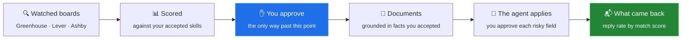
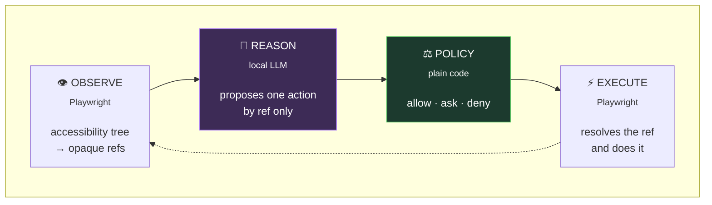
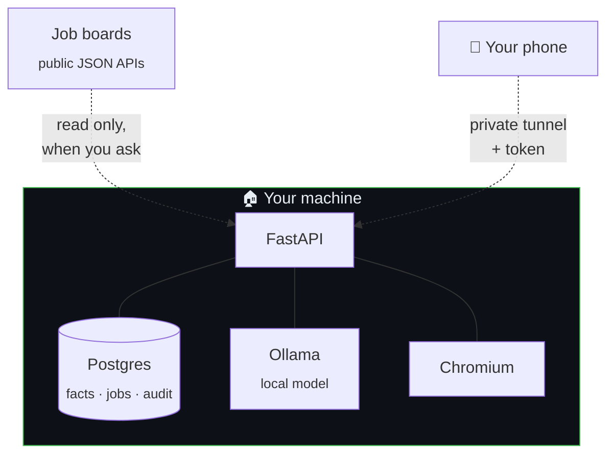

<div align="center">

# LocalApply

**A local-first autonomous job-application workstation.**

Find jobs, score them against your real CV, write documents that only claim what you can back,
and let a browser agent fill the forms — with you approving every consequential action.

Your data never leaves your machine. Nothing is ever submitted without you saying so.

[](#tests)
[](#requirements)
[](#your-data)
[](#safety-properties)

[**Get started**](#get-started) · [**How it works**](#how-it-works) · [**Safety**](#safety-properties) · [**Architecture**](docs/architecture.md) · [**ADRs**](docs/adr)

</div>

---

## What it does



Point it at a company on a job board and new postings arrive already scored against your CV.
Approve one, and it writes a CV and cover letter tailored to that posting — every line traced
to a fact you personally accepted. Then a browser agent fills the form, stopping to ask you
about anything that matters. Record what came back, and it tells you what is actually working.

---

## How it works

Four layers, deliberately separate. The reasoner proposes; it holds no browser handle and
cannot act. The policy engine — plain Python, **no model** — decides. The executor performs
mechanical operations and interprets nothing.



**The model never sees a selector and never emits one.** It gets a table of opaque refs —
`e17 | textbox | required | Email address` — and answers with a ref. Refs are rebuilt every
observation, so a stale one fails closed. A prompt-injected page cannot induce an arbitrary
click, because there is no vocabulary in which to express one. See
[ADR 0002](docs/adr/0002-opaque-element-refs.md).

```mermaid
stateDiagram-v2
    direction LR
    [*] --> discovered
    discovered --> parsed: paste or fetch
    parsed --> analyzed: extract requirements
    analyzed --> scored: match your skills
    scored --> recommended
    recommended --> user_approved: ✋ you confirm
    user_approved --> documents_generating
    documents_generating --> ready_for_browser
    ready_for_browser --> browser_running: hand to the agent
    browser_running --> form_analyzed
    form_analyzed --> safe_fields_filled
    safe_fields_filled --> review_required
    review_required --> submitting: ✋ you approve the submit
    submitting --> submitted
    submitted --> [*]

    browser_running --> blocked: CAPTCHA · login wall
    blocked --> user_intervention
    user_intervention --> form_analyzed: you handled it
```

<details>
<summary><b>The application state machine</b> — eighteen states, and exactly two writers</summary>

<br/>



`SUBMITTING` has exactly one predecessor. A run that detours through a CAPTCHA re-enters
*before* the review gate and passes through it again — resuming can never become a side door
into submission.

The column is written by **two wrappers and no more**: `jobs.pipeline.advance` before the
browser, `RunManager._transition` after. There is a test that greps the package for a third.

</details>

---

## Get started

> **Windows.** Steps 4–5 need a reboot, and none of this is installed by default.

<table>
<tr><td width="60"><h3>1</h3></td><td>

**Disable the Windows Store Python aliases.** Settings → Apps → Advanced app settings → App
execution aliases → turn off `python.exe` and `python3.exe`. The default `python` on PATH is a
Store stub, not an interpreter.

</td></tr>
<tr><td><h3>2</h3></td><td>

**Python 3.12+** from python.org, "Add to PATH" ticked. Verified on 3.14.7 — every dependency,
including `asyncpg` and `greenlet`, has cp314 wheels.

</td></tr>
<tr><td><h3>3</h3></td><td>

`wsl --install` from an admin PowerShell, then **reboot**.

</td></tr>
<tr><td><h3>4</h3></td><td>

**Docker Desktop** with the WSL2 backend. Only Postgres and Redis run in containers — the app
itself runs natively.

</td></tr>
<tr><td><h3>5</h3></td><td>

```powershell
.\dev.ps1 setup
```

</td></tr>
</table>

### Then: one double-click

<div align="center">

### ▶ `LocalApply.exe`

</div>

It checks Docker, brings up the containers, applies any pending migration, generates your API
token, seeds the profile, starts the API, and opens the dashboard — reporting each step and
saying exactly what to do if one fails.

```
[1/8] Docker              OK  Docker engine 29.7.2
[2/8] Postgres + Redis    OK  Postgres and Redis healthy
[3/8] Python environment  OK  Interpreter services\api\.venv\Scripts\python.exe
[4/8] Access              OK  API token in place
...
[8/8] API + dashboard     OK  API listening on port 8000  [DRY RUN]

  Ready  http://127.0.0.1:8000/
```

Ctrl+C stops the API and engages the kill switch on the way out, so no run is left half-way
through a form. The containers stay up, so the next start is quick.

| Flag | |
|---|---|
| `--port <n>` | Serve on a specific port. Without it, the launcher **moves to the next free port** rather than refusing to start over one nobody chose. |
| `--remote` | Also answer your phone. Binds to your tunnel address — never `0.0.0.0` — and refuses outright without a token. |
| `--show-token` | Print the API token. Needed once, to pair a phone. |
| `--no-browser` · `--no-seed` | |

**No Node, no build step, no bundler.** The API serves the dashboard at `/` as one
dependency-free file. There was briefly a second React frontend; it is gone, because two
UIs where one is a stale subset of the other is worse than either.

---

## Safety properties

Enforced structurally and covered by tests — not asserted in a prompt.

| | |
|---|---|
| 🛑 | **Nothing is submitted without you approving that exact action.** `SUBMIT` is its own action type, gated by rule `R010`. Approving one action does not authorise a different value or a different element. |
| 🔗 | **The model cannot address what the observer did not enumerate.** Opaque refs only — never selectors, never coordinates. |
| 🚫 | **Signatures, government IDs, demographic questions and credentials are never filled.** Not at any confidence, and not unlockable by approval. |
| 💉 | **Page content cannot weaken policy.** The policy engine contains no model, so an injection can at most produce a bad proposal — which policy then rejects. |
| 🧪 | **`DRY_RUN=true` by default.** Submits are logged and simulated, never actually clicked. |
| ⏹ | **The kill switch is checked before every action** — by the run loop, by the executor, and before any page is fetched. |
| 📋 | **A job posting cannot advance itself.** Requirement extraction is a regex over a fixed vocabulary and the score is arithmetic. No model anywhere in the pipeline, and no automated path reads the score. |
| 🔑 | **The API is behind a token**, generated on first run. The app **refuses to start** bound to a network address with no token set. |
| 🔕 | **A notification never carries a value.** It says which field needs approving, not what would go in it. |
| ♻️ | **A run always terminates.** The action budget bounds executed actions; asking for help twice about an unchanged page ends the run with a reason. |

<details>
<summary><b>What a real run actually did</b></summary>

<br/>

Driven through the HTTP API, approvals submitted with `source=phone`:

| | |
|---|---|
| Safe fields filled uninterrupted | 10 (`R099_DEFAULT_ALLOW`) |
| Stopped for approval | 4 fields + the submit (`R011`, `R010`) |
| `NEVER_AUTOFILL` fields touched | **0** |
| Submit | `simulated=true`, `R000_HUMAN_APPROVED` |
| Events persisted | 85, seq 1–85, no gaps |

The salary gate was approved with an **edited** value, and the executed action recorded the
edit rather than the draft. An approval authorises exactly what was on screen.

</details>

---

## Your data

Everything lives on your machine. There is no account, no cloud, no telemetry, and the only
outbound requests are to job boards you explicitly asked it to read.



**Back up in one click.** `/backup/export` gives you a zip of plain JSON plus the actual PDF
bytes — readable in ten years by someone who has never heard of this app. Importing round-trips
it exactly, including the entries you corrected by hand.

---

## The parts

<details>
<summary><b>📋 Watched boards</b> — jobs arrive on their own</summary>

<br/>

Greenhouse, Lever and Ashby publish their job boards as public JSON. Point at a company and
every new posting arrives already scored:

```http
POST /searches {"source": "greenhouse", "handle": "vercel", "include": ["engineer"]}
POST /searches/run
```

Documented public endpoints only — no key, no registration, no scraping HTML that needs a
browser to render. One request per board per run, paced per host, stopped instantly by the kill
switch, and deduplicated on `(source, external_id)` so running a search twice is a no-op rather
than a second copy of every job.

**Nothing runs on a timer.** A local-first app that is only on when you are looking at it has
nowhere to hide a scheduler, and a search that fires while you are asleep is one whose results
you cannot watch it produce.

Each board fails silently in its own way, and each is pinned by a test:

| Board | The trap |
|---|---|
| **Greenhouse** | Omits the description entirely without `?content=true` — and still returns 200. Its `content` is entity-*escaped* HTML, so a strip-tags pass finds no tags and hands you a wall of `&lt;p&gt;`. |
| **Lever** | The job title is in `text`, not `title`. `descriptionPlain` is only ~⅓ of the posting — the requirements, where every skill lives, are in `lists[]`. |
| **Ashby** | The primary key is undocumented. Neither it nor Lever tells you the company. |

</details>

<details>
<summary><b>📄 Your CV, as approved facts</b></summary>

<br/>

Upload a CV and it is parsed into individual facts — each **proposed**, never accepted on your
behalf. Nothing reaches a document until you say yes to it.

Extraction from arbitrary PDFs is a draft, not an answer. A CV that writes its dates as
`Full-time | 1 Year` has no date range for any parser to find, so the Profile tab lets you
correct role, organisation, dates and bullets by hand. An edited fact is marked as yours and a
later re-import will not quietly overwrite it.

The app also **refuses its own output**. Someone re-uploaded a LocalApply-generated CV, the
parser read the generator's own footer as an experience bullet, and it appeared on the next CV.
Each round was built from the round before. Now a generated PDF is recognised by hash and
refused.

</details>

<details>
<summary><b>✍️ Documents that only claim what you can back</b></summary>

<br/>

Every line of a generated document traces to an accepted fact — structurally, not by
instruction. A document is assembled as a plan in which each item carries the fact ids behind
it, and rendering refuses a plan containing an item that cites nothing, or that cites a fact
you have not accepted.

With **Write with model** ticked, the model becomes a *rewriter, not an author*: it is handed
one fact's text and asked to say the same thing better. `claims.check_claims` compares the
result against the source and rejects any technology or figure that was not in it. A model that
embellishes loses its embellishment; it cannot get a claim through. See
[ADR 0003](docs/adr/0003-model-is-a-rewriter.md).

The CV follows published ATS parsing rules: single column, standard headings, nothing in a
header or footer, real text rather than CSS generated content, reverse-chronological roles, and
a one-page budget that holds.

</details>

<details>
<summary><b>📬 Did it work?</b></summary>

<br/>

Record what came back — replied, screening, interviewed, offer, rejected — and the board tells
you reply rate by match score, by board, and by company, plus how long people take to answer.

Silence past five weeks reads as ghosted, **derived from the clock rather than stored**, so a
reply in week six simply undoes it.

Rates from fewer than five applications are greyed out and labelled. Three applications with
one reply is not a 33% reply rate, and presenting it as one invites a decision the data cannot
support.

</details>

<details>
<summary><b>👁 Letting the agent see</b> — off by default</summary>

<br/>

The observer walks the accessibility tree and hands the model a table. That works, and running
it against real boards showed what it misses: **eleven of Greenhouse's seventy elements have no
accessible name at all**, and its dropdowns are buttons with hidden inputs behind them. Eleven
blank rows the model is asked to choose between.

```bash
LA_VISION=true
LA_VISION_MODEL=qwen2.5vl:7b
```

**Sight is for perception; refs stay the only vocabulary for action.** The model may look at
the page and must still answer with `e17`. It never emits a coordinate — a coordinate is
unaddressable, unverifiable, and exactly what a prompt-injected page would try to induce. Both
the parser and policy rule `R002` reject an action with no ref, and the tests pin both.

**A page can write instructions in pixels**, so everything the fence does for page text is said
about the image too: the model is told it is looking at a photograph of something a stranger
controls.

**One model does both jobs.** A separate vision model would mean swapping the 5 GB reasoner out
and back on *every* observation — 3–10 s each, inside the loop. The router recognises that the
two roles share a model name and skips the swap entirely. That is not a compromise; it is the
only shape that fits on this card.

With no vision model installed, or no screenshot for an observation, it takes the text path
unchanged. Being blind is the old behaviour and is far better than refusing to decide.

</details>

<details>
<summary><b>🧠 The AI engine, on 8 GB</b></summary>

<br/>

`ai/router.py` loads one large model at a time under an exclusive lock, because a 7–8B Q4
reasoner is ~5 GB and a vision model another ~4 GB — they cannot coexist on this card.
`/health` reports what is *actually* resident, VRAM in use, and how many swaps have happened:
real operational state, not a config echo.

Model swaps cost 3–10 s and are treated as a scheduled orchestration cost.

```bash
pytest              # 667 tests, no model needed
pytest -m ollama    # opt-in: live checks against a running Ollama
pytest -m live      # opt-in: checks the real board APIs have not moved
```

</details>

---

## Tests

```bash
pytest                    # from the repo root
pytest -m "not browser"   # unit only; no Playwright needed
```

Browser tests skip themselves if Chromium is missing. The suite runs on SQLite, so **no Docker
is required**.

<details>
<summary><b>What is covered</b> — 667 assertions, and why each exists</summary>

<br/>

| Area | Assertion |
|---|---|
| `test_loop_integration.py` | A full run reaches `SUBMITTED` only after approval; no submit row exists while parked on the gate; rejecting everything never submits; `agent_events` replays every ref |
| `test_injection.py` | Identical policy verdicts with and without an injection payload; a fully compromised reasoner naming an unobserved element is rejected; no page-controlled string can close the prompt fence |
| `test_policy.py` | Every deny and approval rule; approval does not generalise across values or elements |
| `test_field_classifier.py` | All three safety classes; unknown fields default to *review*; a sentence containing "city" is not a city field; only something you can type into is ever safe |
| `test_state_machine.py` | `SUBMITTING` is reachable from `REVIEW_REQUIRED` and nowhere else |
| `test_browser.py` | Ref enumeration, stale-ref invalidation, kill switch, dry-run submit; an invisible reCAPTCHA is not a wall; a board of filter dropdowns is a listing, not a form |
| `test_cv_import.py` | Extraction and reconciliation; a technology name hiding inside an ordinary word is not a split; a corrupt file and a text-free one report *different* failures |
| `test_cv_import_api.py` | Upload proposes but accepts nothing; the reasoner cannot see a proposed fact; accepting a conflict supersedes rather than deletes |
| `test_generation.py` · `test_generation_api.py` | Grounding refuses an item citing nothing; versions never overwrite; provenance flags facts that changed after sending |
| `test_ats_format.py` | Single column, standard headings, nothing in a footer, no CSS generated content; the summary leads, roles run reverse-chronologically, the page budget holds |
| `test_cover_letter.py` | Every paragraph is a sentence, never a database row; tense follows the dates; a missing requirement is named rather than hidden |
| `test_writer.py` · `test_ai_engine.py` | An invented ref never becomes an action; an invented summary or bullet is thrown away and the composed wording kept |
| `test_connectors.py` | Each board's silent-failure mode, pinned per board; plus opt-in live checks that the field names have not moved |
| `test_discovery.py` | A board cannot advance a job, duplicate one, or put anything but a vocabulary word in the database |
| `test_job_pipeline.py` | Every skip is a 409; the state column has exactly two writers, held by a grep |
| `test_ingest_boundary.py` | Every form that reaches this machine is refused — `localhost.`, `2130706433`, `0x7f000001`, `127.1`; a login wall stores nothing; hosts are paced |
| `test_security.py` | A stranger cannot read the profile; the token is compared in constant time; a new route is behind the gate by default |
| `test_outcomes.py` | Recording an outcome never writes the state column; a rate from three applications is flagged as not enough |
| `test_portability.py` | Export → wipe → import leaves everything identical, including hand-corrected entries |
| `test_notify.py` | A notifier that raises does not reach the caller; a notification never carries a value |
| `test_remote.py` | No token is a refusal, not a warning; keys come from the real `wg` binary or not at all |
| `test_dashboard.py` | The script parses and binds, in a real browser; a job title written by a stranger is escaped, not rendered |
| `test_seeing.py` | Seeing the page never becomes a way to act: a coordinate cannot be expressed, an unobserved ref is still rejected, and one model serving both roles never swaps |

</details>

---

## Not built yet

A phone app (deliberately cut — remote access already puts the dashboard on your phone) ·
anything that approves or applies on your behalf, ever.

<details>
<summary><b>On real job sites</b> — the posture, and its limits</summary>

<br/>

The agent runs against a local fixture by default, on purpose. Automating LinkedIn violates its
User Agreement and risks the account; discovery targets boards with public APIs or permissive
terms instead, and LinkedIn stays manual-assist — you drive the search, the agent observes.

Reading a posting is the one thing that reaches a real site, and its posture is **refuse, do not
evade** — built rather than asserted, and tested as such:

- One URL per fetch, and it is the one **you typed**. A URL found in page content is never
  followed, which removes attacker-directed fetching as a class rather than as a case.
- One navigation. No retry, no second session, no second attempt with different headers.
- No user-agent, header or cookie tampering; a plain browser with no stored session, so there
  is no logged-in account to get banned.
- A login wall or a CAPTCHA stores **nothing**, parks the job, and hands you the URL.
- Per-host pacing, with the wait held inside the lock so fetches queue rather than race.
- Private, loopback, link-local and reserved addresses are refused — before navigating, and
  again on whatever URL the browser actually landed on.

Two limits, written down rather than assumed: the address check reads the URL, not the address
the host resolves to at connect time, so DNS rebinding is not covered; and there is no
`robots.txt` parser in this tree — the mitigations above stand in its place rather than
pretending to honour a file nothing reads.

</details>

---

## Layout

```
services/api/        FastAPI — contracts, browser, ai, policy, orchestrator, jobs, events, db
launcher/            LocalApply.exe
packages/            Shared agent-protocol schemas, generated from contracts.py
infrastructure/      Postgres + Redis compose
evaluation/          The practice posting, and a harness that observes real forms
docs/                Architecture and ADRs
tests/
```

<details>
<summary><b>Setting up by hand</b>, if you would rather not use <code>dev.ps1</code></summary>

<br/>

> **Call every tool as `.venv\Scripts\python.exe -m <tool>`.** Not `activate` then `alembic`.
> Activation is easy to skip silently — and if you do, `pip install` lands in your *global*
> Python and the `alembic` / `uvicorn` / `playwright` commands resolve to nothing, because
> their shims go to a Scripts directory that is not on PATH.

Windows PowerShell 5.1 has **no `&&` operator** — a line containing it fails to parse and
*nothing on that line runs*. One command per line.

```powershell
# from the repo root
docker compose -f infrastructure/docker/docker-compose.yml up -d

cd services\api
python -m venv .venv
.\.venv\Scripts\python.exe -m pip install -e ".[dev]"
.\.venv\Scripts\python.exe -m playwright install chromium

Copy-Item ..\..\.env.example ..\..\.env
.\.venv\Scripts\python.exe -m alembic upgrade head
.\.venv\Scripts\python.exe scripts\dev_bootstrap.py

# Leave this running. Note: no --reload.
.\.venv\Scripts\python.exe -m uvicorn localapply.main:app --port 8000
```

> [!WARNING]
> **Never start the API with `--reload` on Windows.** Reload mode runs uvicorn on a
> `SelectorEventLoop`, where `asyncio.create_subprocess_exec` is not implemented — so
> Playwright cannot spawn its driver and every run dies with a bare `NotImplementedError`,
> while the API itself looks perfectly healthy. `dev.ps1` and the launcher both refuse to pass
> the flag, and `/health` reports the problem if you end up on the wrong loop.

Already installed into your global Python by accident? Harmless, and undone with
`python -m pip uninstall -y localapply`. The venv copy is independent.

</details>

<details>
<summary><b>Hardware</b></summary>

<br/>

Built and measured against an RTX 5070 Laptop (**8 GB VRAM**) with 15 GB RAM. That does not fit
a reasoning model and a vision model at once, so the router loads them sequentially under an
exclusive lock with embeddings pinned. See
[architecture.md](docs/architecture.md#deployment-shape).

</details>

---

<div align="center">
<sub>

**[Architecture](docs/architecture.md)** · **[Agent protocol](docs/agent-protocol.md)** ·
**[ADR 0001 — why the loop is split four ways](docs/adr/0001-observe-reason-policy-execute.md)** ·
**[ADR 0002 — why the model never sees a selector](docs/adr/0002-opaque-element-refs.md)** ·
**[ADR 0003 — a model may rephrase a fact, never author a claim](docs/adr/0003-model-is-a-rewriter.md)**

</sub>
</div>
